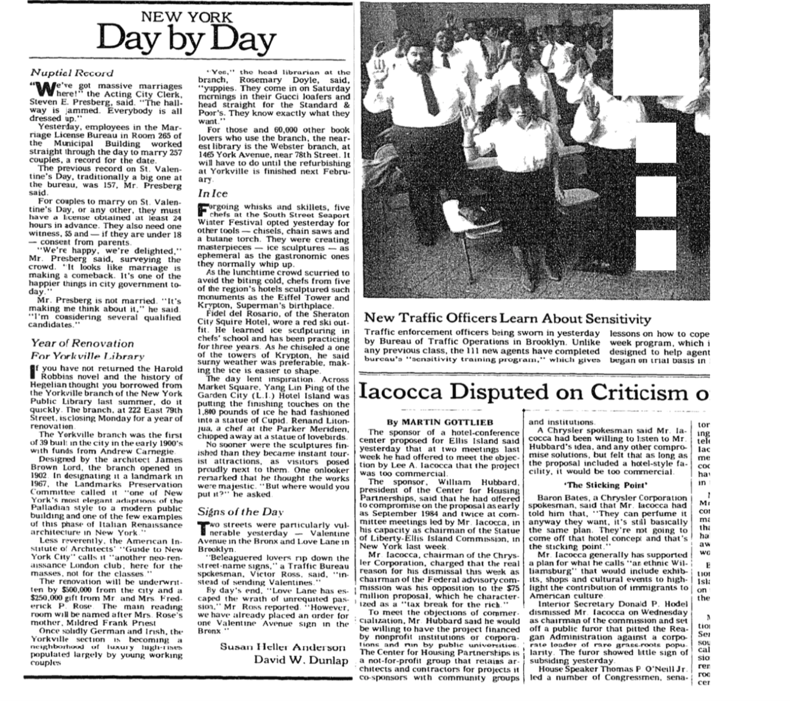

**NEW YORK DAY BY DAY; Year of Renovation For Yorkville Library**
==
**By David W. Dunlap**

**Feb. 15, 1986**
    
If you have not returned the Harold Robbins novel and the history of Hegelian thought you borrowed from the Yorkville branch of the New York Public Library last summer, do it quickly. The branch, at 222 East 79th Street, is closing Monday for a year of renovation.

The Yorkville branch was the first of 39 built in the city in the early 1900's with funds from Andrew Carnegie.

Designed by the architect James Brown Lord, the branch opened in 1902. In designating it a landmark in 1967, the Landmarks Preservation Committee called it ''one of New York's most elegant adaptions of the Palladian style to a modern public building and one of the few examples of this phase of Italian Renaissance architecture in New York.''

Less reverently, the American Institute of Architects' ''Guide to New York City'' calls it ''another neo-renaissance London club; here for the masses, not for the classes.''

The renovation will be underwritten by $500,000 from the city and a $250,000 gift from Mr. and Mrs. Frederick P. Rose. The main reading room will be named after Mrs. Rose's mother, Mildred Frank Priest.

Once solidly German and Irish, the Yorkville section is becoming a neighborhood of luxury high-rises populated largely by young working couples.

''Yes,'' the head librarian at the branch, Rosemary Doyle, said, ''yuppies. They come in on Saturday mornings in their Gucci loafers and head straight for the Standard & Poor's. They know exactly what they want.''

For those and 60,000 other book lovers who use the branch, the nearest library is the Webster branch, at 1465 York Avenue, near 78th Street. It will have to do until the refurbishing at Yorkville is finished next February.

