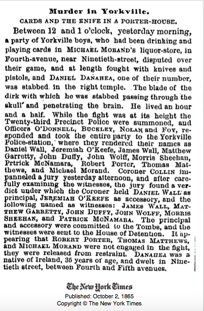

Murder in Yorkville.
CARDS AND THE KNIFE A PORTER-HOUSE. 
Between 12 and 1 o'clock, yesterday morning, a party of Yorkville boys, who had been drinking and playing cards in MICHAEL MORAND'S liquor-store, in Fourth-avenue, near Ninetieth-street, disputed over their game, and at length fought with knives and pistold, and DANIEL DANAHEA, one of their number, was stabbed in the right temple. The blade of the dirk with which he was stabbed passing through the skull and penetrating the brain. He lived an hour and a half. While the fight was at its height the Twenty-third Precinct Police were summoned, and Officers O'DONNELL, BUCKLEY, NOLAN and FOY, responded and took the entire party to the Yorkville Police-station, where they rendered their names as Daniel Wall, Jeremiah O'Keefe, James Wall, Matthew Garrety, John Duffy, John Wolff, Morris Sheehan, Prtrick McNamara, Robert Porter, Thomas Matthews, and Michael Morand. Coroner COLLIN impanneled jury yesterday afternoon, and after carefully examinng the witness, the jury found a verdict under which the Coroner held DANIEL WALL as principle, JEREMIAH O'KEEFE as accessory, and the illowing named as witness: JAMES WALL, MATTHEW GARRETTY, JOHN DUFFY, JOHN WOLFF, MORRIS SHEEHAN, and PATRICK MoNAMARA. The principal and accessory were committed to the Tombs, and the witnesses were sent to the House of Detention. It appearing that ROBERT PORTER, THOMAS MATTHEWS, and MICHAEL MORAND were not engaged in the fight, they were released from restraint. DANAHEA was a native of Ireland, 35 years of age, and dwelt in Ninetieth street, between Fourth and Fifth avenues. 
The New York Times
Published: October 2, 1865
Copyright © The New York Times

