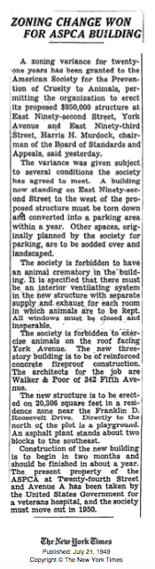

ZONING CHANGE WON FOR ASPCA BUILDING
==
A zoning variance for twenty-one years has been granted to the American Society for the Prevention of Cruelty to Animals, permitting the organization to erect its proposed $950,000 structure at East Ninety-second Street, York Avenue and East Ninety-third Street, Harris H. Murdock, chairman of the Board of Standards and Appeals, said yesterday.

The variance was given subject to several conditions the society has agreed to meet. A building now standing on East Ninety-second Street to the west of the proposed structure must be torn down
And converted into a parking area within a year. Other spaces, originally planned by the society for
parking, are to be sodded over and landscaped.

The society is forbidden to have an animal crematory in the building. It is specified that there must
be an interior ventilating system in the new structure with separate supply and exhaust for each room
in which animals are to be kept. All windows must be closed and inoperable. The society is forbidden to exercise animals on the roof facing York. Avenue. The new three story building is to be of reinforced concrete fireproof construction. The architects for the job are Walker & Poor of 342 Fifth Avenue.

The new structure is to be erected on 20,306 square feet in a residence zone near the Franklin D. Roosevelt Drive. Directly to the north of the plot is a playground. An asphalt plant stands about two blocks to the southeast.

Construction of the new building is to begin in two months and should be finished in about a year.
The present property of the ASPCA at Twenty-fourth Street and Avenue A has been taken by the United States Government for a veterans hospital, and the society must move out in 1950.

The New York Times
Published: July 21, 1949
Copyright The New York Times

